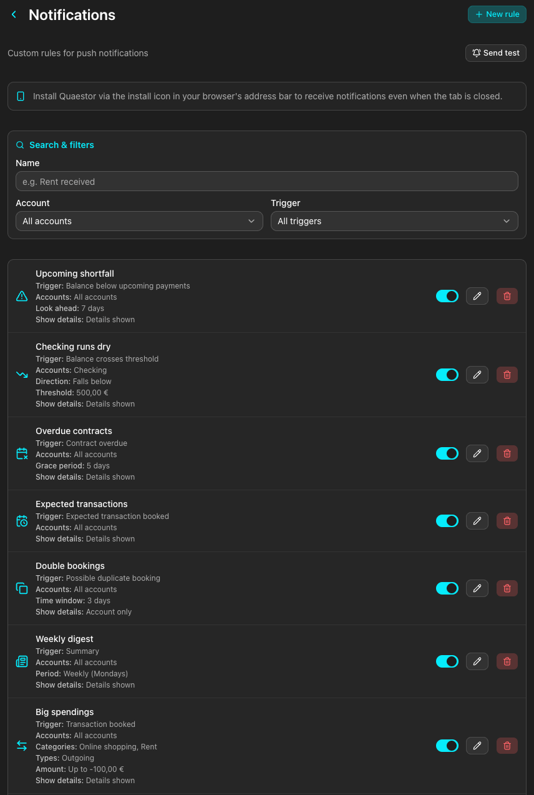

# Quaestor

> "The Quaestor [...] is a senior executive, and is responsible for the finances [...]; the equivalent of treasurer, Finance Director." Source: [Wikipedia](https://en.wikipedia.org/wiki/Quaestor_(University_of_St_Andrews))

Quaestor consolidates the balances and transactions from all your banks into a single view → no more juggling a separate app per bank. Click any account to browse its transactions, grouped by date.

This app is heavily inspired by [Finanzguru](https://finanzguru.de/), with the key benefit that it is completely free, open source, and **private** since all the data stays on your own server.

The tool is strictly read-only: it only ever *reads* your data and can **never** make changes to your accounts or move money.

This app is primarily intended for German users. You can find the reason for this in the [supported banks](#supported-banks) section.

## Screenshots

<details>
<summary>Click to expand</summary>

**Overview**: Dark mode


**Overview**: Light mode


**Account**: A single account showing its current balance and its transactions grouped by date


**Manual account**: A manually managed account where you can add and edit transactions yourself


**Creation of Transaction in manual account**: Create a single or recurring transaction in your manual account


**Transaction**: The detail view of a transaction with a personal note


**Search**: Search for transactions across all accounts with specific filters such as keywords, dates, categories, notes, etc.


**Statistics**: View diagrams about your financial data, grouped by account, time, and category


**Bank connections**: The list of connected banks


**Adding a bank connection**: Search for a bank and add it


**Bank connection details**: Settings for a single connection


**Account groups**: Drag accounts into custom groups to control how they are organized in the overview


**User settings**


**2FA support**: Create a token to enable 2FA for your account (and get backup codes in case you lose access to your device)


**Notifications**: Create custom rules for notifications based on account balances, transaction amounts, or other criteria.



</details>

## Features

- **Unified overview** of all your bank accounts and their balances in one place
- **Multiple connection types**: Connects to multiple banks to fetch your data, see the [supported banks](#supported-banks) section
- **Automatic background syncing** on a configurable interval, plus on-demand sync
- **Transactions grouped by date**, covering past, today, and future entries (some bank apps, such as ING, don't show future transactions)
- **Balance on any date**: See what an account's balance or the sum of multiple account balances were on a given day
- **Statistics**: View diagrams about your financial data, grouped by account, time, and category.
- **Search** for transactions across all accounts
- **Automatic and manual categorization** of transactions
- **Account balance at date**: See what an account's balance was on a given day
  - This includes your normal bank accounts with simple incoming and outgoing transactions,
  - But also banks such as Trade Republic. For e.g. Trade Republic in Questor you can see how much your holdings of an individual stock were worth on a given date.
  - This information is not even visible in their app as their api does not provide it. Questor fetches all relevant data and calculates the balance on the fly.
- **Custom notes** on transactions
- **Account groups**: Drag accounts into your own groups to organize the overview
- **Multi-language** interface (English & German (add an issue for another requested language))
- **Session management**: Review active logins and sign out individual sessions
- **Light & dark mode**
- **API keys**: Create personal API keys in your settings to interact with the backend programmatically with the same access as the frontend; keys are shown once, stored as hashed values, and can be revoked at any time. The docs are available on `<your instance url>/redoc` and on [GitHub](https://quaestordocs.fschneider.me/).
- **Notifications**: Create custom rules for notifications based on account balances, transaction amounts, or other criteria.
  - These fire on your phone even when the app is not running.

## Supported banks

Quaestor connects to banks through several handlers, see [docs/bank_handlers](docs/bank_handlers/README.md).

You can browse the full list of every supported bank [here](https://quaestordocs.fschneider.me/banks.html) where every entry carries a badge naming its handler.

## Security

I understand that any project with access to your bank accounts is, by nature, handling sensitive information.
Security measures in place:

 - Your data stays with you: First of all, when you compare it to a software like Finanzguru, Quaestor has the big advantage that **your** data stays on **your** server. You don't share any passwords or other banking information with a third party.
 - Encryption at rest: The SQLite database is fully encrypted, meaning its contents cannot be read without the encryption key (no matter whether the software is currently running or not). This applies not only to your account credentials but to **all** data stored in the database.
 - Secure communication with banks: All communication with banking servers is exclusively done via HTTP**S**.
 - Secure access to the server: I strongly recommend accessing the server only via HTTP**S** as well. Set `SSL_CERTFILE` and `SSL_KEYFILE` to enable it (see `Environment`); without them the server runs plain HTTP. Alternatively use a reverse proxy.
 - Two-factor authentication: A user is able to enable two-factor authentication for their account.
 - Read-only operations: The software only performs read requests; it **never** writes, updates, or deletes any resources on your accounts.
 - All the dependencies are pinned and automatically updated via Dependabot: All the updates for dependencies do have to be at least 3 days old to prevent supply chain attacks before being automatically merged.
 - There is no administration account/interface: A user can only access his/her own accounts/credentials/transactions. There is no possibility for an admin to access the data of another user (other than by accessing the database directly).
 - CSRF protection: state-changing requests require a `csrf_token` cookie + matching `X-CSRF-Token` header.
 - Rate limiting: auth endpoints are throttled heavily per source IP. Set `FORWARDED_ALLOW_IPS` if behind a reverse proxy.
 - Hardened headers and cookies: `Content-Security-Policy`, `HttpOnly`, `SameSite=Lax`, CSRF: `SameSite=Strict`, `Secure` flag when (`SESSION_COOKIE_SECURE=true`).
 - The container image runs as an unprivileged user.

## Deployment

In all cases you have to create an encryption key for the database with `python -c 'import secrets; print(secrets.token_hex(32))'` and add it to your `.env` as `${DATABASE_ENCRYPTION_KEY}`.

If you are running this app behind a reverse proxy ensure to allow the usage of websockets (the application needs it).

### Container image

|                  | Existing image                                                                                                         | Build image yourself                                                                                                                                                                                                        |
|------------------|------------------------------------------------------------------------------------------------------------------------|-----------------------------------------------------------------------------------------------------------------------------------------------------------------------------------------------------------------------------|
| `docker run`     | `docker run -e DATABASE_ENCRYPTION_KEY=${DATABASE_ENCRYPTION_KEY} -v ./data/:/data ghcr.io/felixschndr/quaestor`       | `git clone git@github.com:felixschndr/quaestor.git && cd quaestor && docker build . -t quaestor && docker run -e DATABASE_ENCRYPTION_KEY=${DATABASE_ENCRYPTION_KEY} -e HOST=0.0.0.0 -v ./data/:/data -p 8080:8080 quaestor` |
| `docker compose` | `wget https://raw.githubusercontent.com/felixschndr/quaestor/refs/heads/main/docker-compose.yaml && docker compose up` | `git clone git@github.com:felixschndr/quaestor.git && cd quaestor && sed -i 's,image: ghcr.io/felixschndr/quaestor,build: .,' docker-compose.yaml && docker compose up`                                                     |

As this image does not run as `root` you **MUST** ensure that the user with the ID `1000` owns the location where you mount the `data` directory to on the host:
```bash
data_dir="data" # wherever you bind-mounted the data directory to
mkdir -p ${data_dir} && sudo chown 1000:1000 ${data_dir}
```

As an alternative, you can use a named volume instead. A commented out volume mount is already present in the `docker-compose.yaml`.

### Native

#### Requirements

- [Python 3.14](https://www.python.org/)
- [Poetry](https://python-poetry.org/)
- [pnpm](https://pnpm.io/)

#### Running

1. Clone the repository: `git clone git@github.com:felixschndr/quaestor.git`
2. Change to the directory: `cd quaestor`
3. Create a db key and add it to `.env`: `echo -n "DATABASE_ENCRYPTION_KEY=" >> .env && python -c 'import secrets; print(secrets.token_hex(32))' >> .env`
4. Install the requirements: `poetry install`
5. Build the frontend: `cd source/frontend && pnpm install && pnpm build && cd ../..`
6. Run the application: `poetry run python -m source.backend.server`
7. Access the application on [127.0.0.1:8000](http://127.0.0.1:8000)


### Access the DB

If you need/want to access the database, you can do so with

| Native             | Container                                |
|--------------------|------------------------------------------|
| `./scripts/db/db.sh`  | `docker exec -it quaestor scripts/db/db.sh` |

The script resolves the database path and encryption key automatically (see `scripts/db/db_common.sh` for overrides such as `DB_PATH` and `ENV_FILE`).

Then you can use standard sqlite syntax such as
````
sqlite> .tables
sqlite> .mode box
sqlite> SELECT * FROM users;
````

`sqlcipher` is installed in the container image.

To reset the password of a user and disable his/her two-factor authentication use

| Native                                                | Container                                                                       |
|-------------------------------------------------------|---------------------------------------------------------------------------------|
| `USERNAME=<user> PW=<new pw> ./scripts/db/resetpw.sh`    | `docker exec -e USERNAME=<user> -e PW=<new pw> quaestor scripts/db/resetpw.sh`     |

## Environment Variables

| Name                          | Description                                                                                                                                                                                                 | Default value                                                   |
|-------------------------------|-------------------------------------------------------------------------------------------------------------------------------------------------------------------------------------------------------------|-----------------------------------------------------------------|
| `HOST`                        | The host the server is listening on.                                                                                                                                                                        | `127.0.0.1`                                                     |
| `PORT`                        | The port the server is listening on.                                                                                                                                                                        | `8000`                                                          |
| `DATA_DIR`                    | Directory holding all persistent data.                                                                                                                                                                      | `<REPO_ROOT>/data` or `/data` (when running inside a container) |
| `DATABASE_ENCRYPTION_KEY`     | The key to encrypt the database with. **Must** be provided.                                                                                                                                                 | -                                                               |
| `SSL_CERTFILE`                | The path to SSL certfile to use for HTTPS, only valid in combination with `SSL_KEYFILE`.                                                                                                                    | -                                                               |
| `SSL_KEYFILE`                 | The path to SSL certfile to use for HTTPS, only valid in combination with `SSL_CERTFILE`.                                                                                                                   | -                                                               |
| `ALLOW_NEW_USER_REGISTRATION` | Whether new users may register; set to anything other than `true` to disable.                                                                                                                               | `true`                                                          |
| `DEFAULT_LANGUAGE`            | The language new users start with (e.g. `en`, `de`). Each user can change it later in their settings. Unsupported values fall back to `en`.                                                                 | `en`                                                            |
| `DISPLAY_TIMEZONE`            | The IANA time zone (e.g. `Europe/Berlin`) the frontend renders timestamps in.                                                                                                                               | `UTC`                                                           |
| `LOG_LEVEL`                   | The level to log at. When set to `DEBUG` all the http request and response data is logged. The app tries (but not ensures) to redact all sensible data. Don't set the `LOG_LEVEL` to `DEBUG` in production. | `INFO`                                                          |
| `SYNC_INTERVAL_HOURS`         | How often (in hours) the server automatically syncs all credentials that don't require 2FA. Accepts fractional values (e.g. `0.5`).                                                                         | `12`                                                            |
| `SESSION_COOKIE_SECURE`       | Whether to set the `Secure` flag on the session and CSRF cookies. Set to `true` whenever the app is reachable over HTTPS.                                                                                   | `false`                                                         |
| `FORWARDED_ALLOW_IPS`         | Comma-separated list of reverse-proxy IPs whose `X-Forwarded-For` / `X-Forwarded-Proto` headers the server trusts. Use `*` if the proxy IP is unpredictable (e.g. in container networks).                   | `127.0.0.1`                                                     |

## Future changes

Ideas I might want to implement in the future are tracked as [`enhancement` issues](https://github.com/felixschndr/quaestor/issues?q=is%3Aissue+state%3Aopen+label%3Aenhancement). If you think anything is missing, feel free to open an issue/PR.

## Troubleshooting

### Notifications

#### General

**Q: My notifications don't work at all?**

**A:** Make sure your instance is served over `HTTPS`. Browsers only allow push notifications (and the service worker they rely on) in a secure context, so notifications will never work over plain `http://`. See the `SSL_CERTFILE`/`SSL_KEYFILE` and `SESSION_COOKIE_SECURE` environment variables, or terminate TLS at a reverse proxy in front of the app.

#### Desktop

**Q: Why don't notifications arrive on desktop?**

**A:** The cause is usually that the browser's persistent connection to its push service (Chrome's FCM channel) broke (e.g., stuck after a network or VPN change). Open [chrome://gcm-internals](chrome://gcm-internals) and check the `Connection State` under `Device Info`:

- If it shows `CONNECTED`, the channel is up and the problem is elsewhere; most likely browser or OS settings. Make sure notifications are allowed for the site in the browser, that the browser is allowed to send notifications in your OS settings, and that no focus/do-not-disturb mode is suppressing them.
- If it shows anything else (e.g. `WAITING FOR NETWORK CHANGE`), the browser isn't connected to the push service, so nothing can be delivered. Restart the browser and re-establish the internet connection (e.g. toggle Wi-Fi off and on). Reload `chrome://gcm-internals` afterwards to confirm the state is now `CONNECTED`.

### Database

**Q: The app crashes on startup with `unable to open database file` (`sqlcipher3.dbapi2.OperationalError`)?**

**A:** The container runs as user `1000`, but the directory you bind-mount to `/data` is owned by another user (usually `root`, because Docker created it for you on first start). That user can't write there, so the database file can't be created. Give user `1000` ownership of the host directory before starting.
Read how to do this in the section about [installation](#container-image).
