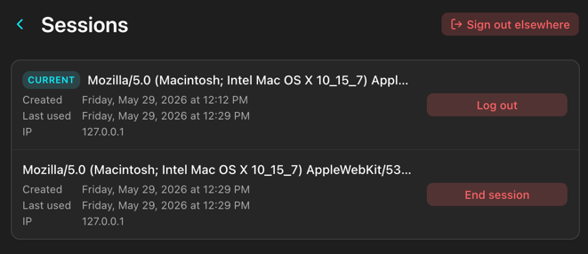

# Quaestor

Your self-hosted, read-only treasurer: a personal finance overview across all your bank accounts.

The idea behind this app is to give you an overview of all your bank accounts and thus consolidating multiple apps. The app allows you to see the balances of all accounts you own. By clicking on one of the accounts you can see the transactions of the account.
The tool is exclusively read-only. It can**not** write to any accounts (i.e., make changes to the account or do transactions).

> [!NOTE]
> This project is still in early development and might include major changes in the near future.

## Screenshots

<details>
<summary>Click to expand</summary>

**Overview**: Dark mode


**Overview**: Light mode


**Account**: A single account showing its current balance and its transactions grouped by date


**Manual account**: A manually managed account where you can add and edit transactions yourself


**Transaction**: The detail view of a transaction with a personal note


**Settings**


**Bank connections**: The list of connected banks


**Bank connection details**: Settings for a single connection


**Account groups**: Drag accounts into custom groups to control how they are organized in the overview


**User settings**


**Sessions**: Active login sessions with options to log out individual sessions



</details>


## Security

I understand that any project with access to your bank accounts is, by nature, handling sensitive information.
Security measures in place:

 - Encryption at rest: The SQLite database is fully encrypted, meaning its contents cannot be read without the encryption key (no matter whether the software is currently running or not). This applies not only to your account credentials but to **all** data stored in the database.
 - Secure communication with banks: All communication with banking servers is exclusively done via HTTP**S**.
 - Secure access to the server: I strongly recommend accessing the server only via HTTP**S** as well. Set `SSL_CERTFILE` and `SSL_KEYFILE` to enable it (see `Environment`); without them the server runs plain HTTP. Alternatively use a reverse proxy.
 - Read-only operations: The software only performs read requests; it **never** writes, updates, or deletes any resources on your accounts.
 - All the dependencies are pinned and automatically updated via Dependabot: All the updates for dependencies do have to be at least 3 days old to prevent supply chain attacks before being automatically merged.
 - There is no administration account/interface: A user can only access his/her own accounts/credentials/transactions. There is no possibility for an admin to access the data of another user (other than by accessing the database directly).
 - CSRF protection: state-changing requests require a `csrf_token` cookie + matching `X-CSRF-Token` header.
 - Rate limiting: auth endpoints are throttled heavily per source IP. Set `FORWARDED_ALLOW_IPS` if behind a reverse proxy.
 - Hardened headers and cookies: `Content-Security-Policy`, `HttpOnly`, `SameSite=Lax`, CSRF: `SameSite=Strict`, `Secure` flag when (`SESSION_COOKIE_SECURE=true`).

## Commands

- Generate a DB Encryption secret: `python -c 'import secrets; print(secrets.token_hex(32))'`
- Run the application
  - Native: `poetry run python -m source.backend.server`
  - Docker: `docker build . -t app && docker run -e DATABASE_ENCRYPTION_KEY=${DATABASE_ENCRYPTION_KEY} -it app`
- DB
  - CLI-Access:
    ````shell
    source .env
    sqlcipher -cmd "PRAGMA key='$DATABASE_ENCRYPTION_KEY'" bank_app.db
    sqlite> .tables
    sqlite> SELECT id, user_id, bank, username FROM credentials;
    ````
  - Migrations:
    - Create DB migration
      - With message: `poetry run alembic revision --autogenerate`
      - Without message: `poetry run alembic revision --autogenerate -m "<message>"`
    - Apply DB migration: `poetry run alembic upgrade head`

## Environment Variables

| Name                          | Description                                                                                                                                                                                                 | Default value |
|-------------------------------|-------------------------------------------------------------------------------------------------------------------------------------------------------------------------------------------------------------|---------------|
| `HOST`                        | The host the server is listening on                                                                                                                                                                         | `127.0.0.1`   |
| `PORT`                        | The port the server is listening on                                                                                                                                                                         | `8000`        |
| `SSL_CERTFILE`                | The path to SSL certfile to use for HTTPS, only valid in combination with `SSL_KEYFILE`                                                                                                                     | None          |
| `SSL_KEYFILE`                 | The path to SSL certfile to use for HTTPS, only valid in combination with `SSL_CERTFILE`                                                                                                                    | None          |
| `ALLOW_NEW_USER_REGISTRATION` | Whether new users may register; set to anything other than `true` to disable                                                                                                                                | `true`        |
| `LOG_LEVEL`                   | The level to log at. When set to `DEBUG` all the http request and response data is logged. The app tries (but not ensures) to redact all sensible data. Don't set the `LOG_LEVEL` to `DEBUG` in production. | `INFO`        |
| `SYNC_INTERVAL_HOURS`         | How often (in hours) the server automatically syncs all credentials that don't require 2FA. Accepts fractional values (e.g. `0.5`).                                                                         | `12`          |
| `SESSION_COOKIE_SECURE`       | Whether to set the `Secure` flag on the session and CSRF cookies. Set to `true` whenever the app is reachable over HTTPS.                                                                                   | `false`       |
| `FORWARDED_ALLOW_IPS`         | Comma-separated list of reverse-proxy IPs whose `X-Forwarded-For` / `X-Forwarded-Proto` headers the server trusts. Use `*` if the proxy IP is unpredictable (e.g. in container networks).                   | `127.0.0.1`   |


## TODO
- ING VL
- Handling for wrong banking credentials
- The trade republic session state COULD include the information about how long until a new 2FA is required (.traderepublic.com	TRUE	/	TRUE	1779099997	aws-waf-token)
- Detect transfer transactions
